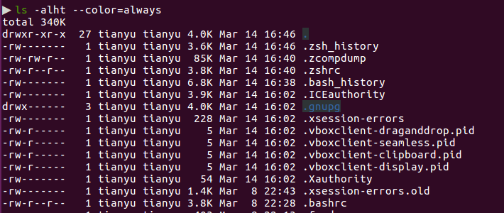

# Exercises-02-Shell-Tools-and-Scripting

1. **Read [`man ls`](http://man7.org/linux/man-pages/man1/ls.1.html) and write an `ls` command that lists files in the following manner**

   - **Includes all files, including hidden files**

   - **Sizes are listed in human readable format (e.g. 454M instead of 454279954)**
   - **Files are ordered by recency**
   - **Output is colorized**

   ```bash
   ls -alht --color=always
   ```

   

   `-a` or `--all`: do not ignore entries starting with .

   `-l`: use a long listing format

   `-h` or `--human-readable`: print sizes like 1K 234M 2G etc. -

   `-t`: sort by modification time, newest first

   `--color=WHEN`: colorize the output; WHEN can be 'always' (default if omitted), 'auto', or 'never'; 

2. **Write bash functions  `marco` and `polo` that do the following. Whenever you execute `marco` the current working directory should be saved in some manner, then when you execute `polo`, no matter what directory you are in, `polo` should `cd` you back to the directory where you executed `marco`.**
   **For ease of debugging you can write the code in a file `marco.sh` and (re)load the definitions to your shell by executing `source marco.sh`.** 

   ```bash
   # march.sh
   marco() {
   	export MARCO=$(pwd)
   }
   
   # polo.sh
   polo() {
   	cd "$MARCO"
}
   ```

   (Do `source marco.sh` and `source polo.sh` before to save the functions.)
   
3. **Say you have a command that fails rarely. In order to debug it you need to capture its output but it can be time consuming to get a failure run.**
   **Write a bash script that runs the following script until it fails and captures its standard output and error streams to files and prints everything at the end.**
   **Bonus points if you can also report how many runs it took for the script to fail.**

   ```bash
    #!/usr/bin/env bash
   
    n=$(( RANDOM % 100 ))
   
    if [[ n -eq 42 ]]; then
       echo "Something went wrong"
       >&2 echo "The error was using magic numbers"
       exit 1
    fi
   
    echo "Everything went according to plan"
   ```

   (it should be `"$n"` instead of `n` on line 5?)
   
   Answer:
   
   ```bash
   #!/bin/bash
   
   count=0 
   # after the previous line, $? = 0, so we can do the following
   
   while [ "$?" -eq 0 ]; do 
       count=$(($count+1))
       ./random.sh &> out.txt 
   done
   
   echo "found error after $count runs"
   cat out.txt
   ```
   
   (do `chmod` to random.sh to make it executable, or line 8 will report command not found. )
   
4. **As we covered in lecture `find`’s `-exec` can be very powerful for performing operations over the files we are searching for. However, what if we want to do something with all the files, like creating a zip file? As you have seen so far commands will take input from both arguments and STDIN. When piping commands, we are connecting STDOUT to STDIN, but some commands like `tar` take inputs from arguments. To bridge this disconnect there’s the [`xargs`](http://man7.org/linux/man-pages/man1/xargs.1.html) command which will execute a command using STDIN as arguments. For example `ls | xargs rm` will delete the files in the current directory.**

   **Your task is to write a command that recursively finds all HTML files in the folder and makes a zip with them. Note that your command should work even if the files have spaces (hint: check `-d` flag for `xargs`)**

   First we should make some test files using: `touch test\ {01..06}.html`

   The command we want here is:

   ```bash
   find . -name '*.html' -type f -print0 | xargs -0 tar -cvzf res.tar.gz
   ```

   If we do not need to do it recursively, the easy version is:

   ```bash
   tar -cvzf res.tar.gz *.html
   ```

5. **(Advanced) Write a command or script to recursively find the most recently modified file in a directory. More generally, can you list all files by recency?**

   Solution 1, using `xargs`:

   ```bash
   find . -type f -print0 | xargs -0 ls -lt
   ```

   Solution 2, using `-exec`:

   (The result does not seem right, can anyone help here?)

   ```bash
   find . -type f -print0 -exec ls -lt {} \;
   ```

   

